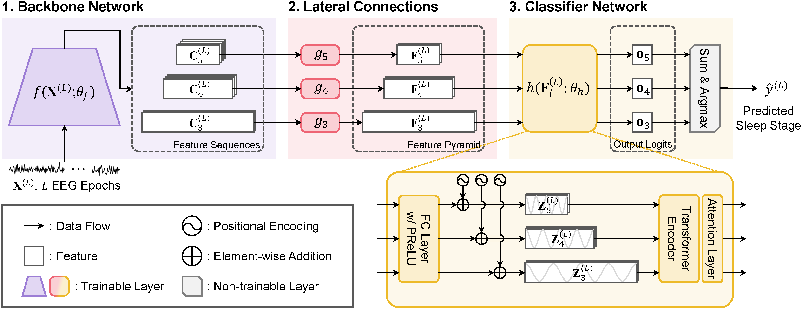
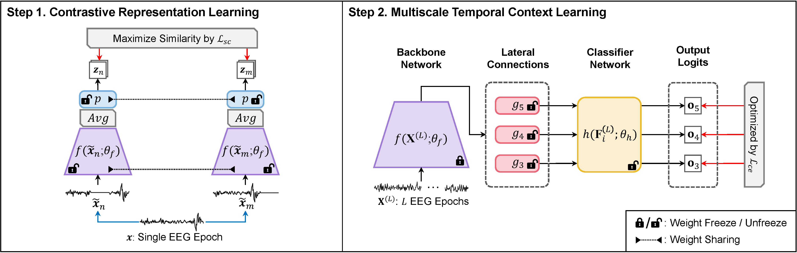

# SleePyCo

[](https://paperswithcode.com/sota/sleep-stage-detection-on-sleep-edf?p=sleepyco-automatic-sleep-scoring-with-feature) [](https://paperswithcode.com/sota/sleep-stage-detection-on-sleep-edfx?p=sleepyco-automatic-sleep-scoring-with-feature) [](https://paperswithcode.com/sota/sleep-stage-detection-on-mass-single-channel?p=sleepyco-automatic-sleep-scoring-with-feature) [](https://paperswithcode.com/sota/sleep-stage-detection-on-physionet-challenge?p=sleepyco-automatic-sleep-scoring-with-feature) [](https://paperswithcode.com/sota/sleep-stage-detection-on-shhs-single-channel?p=sleepyco-automatic-sleep-scoring-with-feature)


By Seongju Lee, Yeonguk Yu, Seunghyeok Back, Hogeon Seo, and Kyoobin Lee

This repo is the official implementation of "***SleePyCo: Automatic Sleep Scoring with Feature Pyramid and Contrastive Learning***", accepted to ***Expert Systems With Applications (I.F. 8.5)***.

[[Paper](https://doi.org/10.1016/j.eswa.2023.122551)] [[CodeOcean](https://codeocean.com/capsule/1417356/tree)]

## Model Architecture


## Training Framework


## Updates & TODO Lists
- [X] (2023.03.03) Official repository of SleePyCo is released
- [X] Script for preprocessing Sleep-EDF
- [X] Config files for training from scratch
- [X] (2023.11.09) Config files for ablation studies
- [X] Add TinySleepNet baseline and Fix minor errors
- [X] You can download checkpoints more conveniently!
- [X] (2023.11.18) 🎉Online publication is available!🎉
- [X] (2024.05.20) Add source code for plot hypnogram in ```./tools```
- [X] (2024.05.20) Add source code for test on a sample of custom data, refer to ```test_custom.py```
- [ ] Scripts for preprocessing MASS, Physio2018, SHHS


## Getting Started

### Environment Setup

Trained and evaluated on NVIDIA GeForce RTX 3090 with python 3.8.5.

1. Set up a python environment
```
conda create -n sleepyco python=3.8.5
conda activate sleepyco
```

2. Install PyTorch with compatible version to your develop env from [PyTorch official website](https://pytorch.org/).

3. Install remaining libraries using the following command.
```
pip install -r requirements.txt
```

### Dataset Preparation
#### Sleep-EDF dataset
1. Download `Sleep-EDF-201X` dataset via following command. (`X` will be `3` or `8`)
```
cd ./dset/Sleep-EDF-201X
python download_sleep-edf-201X.py
```

2. Check the directory structure as follows
```
./dset/
└── Sleep-EDF-201X/
    └── edf/
        ├── SC4001E0-PSG.edf
        ├── SC4001EC-Hypnogram.edf
        ├── SC4002E0-PSG.edf
        ├── SC4002EC-Hypnogram.edf
        ├── ...
```

3. Preprocess `.edf` files into `.npz`.
```
python prepare_sleep-edf-201X.py
```

4. Check the directory structure as follows
```
./dset/
└── Sleep-EDF-201X/
    ├── edf/
    │   ├── SC4001E0-PSG.edf
    │   ├── SC4001EC-Hypnogram.edf
    │   ├── SC4002E0-PSG.edf
    │   ├── SC4002EC-Hypnogram.edf
    │   ├── ...
    │
    └── npz/
        ├── SC4001E0-PSG.npz
        ├── SC4002E0-PSG.npz
        ├── ...
```

## Train & Evaluation (SleePyCo Training Framework)
### Contrastive Representation Learning
```
python train_crl.py --config configs/SleePyCo-Transformer_SL-01_numScales-1_{DATASET_NAME}_pretrain.json --gpu $GPU_IDs
```
When one GeForce RTX 3090 GPU is used, it may requires 22.3 GB of GPU memory.

### Multiscale Temporal Context Learning
```
python train_mtcl.py --config configs/SleePyCo-Transformer_SL-10_numScales-3_{DATASET_NAME}_freezefinetune.json --gpu $GPU_IDs
```

When two GeForce RTX 3090 GPU is used, it may requires 16.7 GB of GPU memory each.

If you use PyTorch $\geq$ 2.0.0, it may requires only 5.4 GB of GPU memory.

## Train & Evaluation (From Scratch)
```
python train_mtcl.py --config configs/SleePyCo-Transformer_SL-10_numScales-3_{DATASET_NAME}_scratch.json --gpu $GPU_IDs
```

## Main Results
|   **Dataset**  | **Subset** | **Channel** | **ACC** | **MF1** | **Kappa** | **W** | **N1** | **N2** | **N3** | **REM** | **Checkpoints** |
|:--------------:|:----------:|:-----------:|:-------:|:-------:|:---------:|:-----:|:------:|:------:|:------:|:-------:|:---------------:|
| Sleep-EDF-2013 |     SC     |    Fpz-Cz   |   86.8  |   81.2  |   0.820   |  91.5 |  50.0  |  89.4  |  89.0  |   86.3  | [Link](https://drive.google.com/file/d/1oUs8S9dVwmTJi9t9zh7msmJT_B28OpbP/view?usp=sharing) |
| Sleep-EDF-2018 |     SC     |    Fpz-Cz   |   84.6  |   79.0  |   0.787   |  93.5 |  50.4  |  86.5  |  80.5  |   84.2  | [Link](https://drive.google.com/file/d/1RdWl9AUMkFlNwUE2qxx3v5XcL3Exs0Pk/view?usp=sharing) |
|      MASS      |   SS1-SS5  |    C4-A1    |   86.8  |   82.5  |   0.811   |  89.2 |  60.1  |  90.4  |  83.8  |   89.1  | [Link](https://drive.google.com/file/d/16kPPhW04g5swGQeOJs8aRJOI13wSEKhI/view?usp=sharing)                 |
|   Physio2018   |      -     |    C3-A2    |   80.9  |   78.9  |   0.737   |  84.2 |  59.3  |  85.3  |  79.4  |   86.3  | [Link](https://drive.google.com/file/d/1r4NXeSzmP5rp_WTTGxiwHLGzknjPV8PT/view?usp=sharing) |
|      SHHS      |   shhs-1   |    C4-A1    |   87.9  |   80.7  |   0.830   |  92.6 |  49.2  |  88.5  |  84.5  |   88.6  | [Link](https://drive.google.com/file/d/1FwjtO3JLd1Di0yRmz7g4B0niyY0gzQEd/view?usp=sharing) |

### How to reproduce results
1. Download and extract checkpoint using `python download_checkpoints.py`.

* You can download all checkpoints using following command:
  ```
  cd checkpoints
  python download_checkpoints.py
  ```

* You can also select checkpoints as follows:
  ```
  cd checkpoints
  python download_checkpoints.py --datasets 'Sleep-EDF-2013' 'Sleep-EDF-2018'
  ```

2. Evaluate the dataset using the following command.
```
python test.py --config configs/SleePyCo-Transformer_SL-10_numScales-3_{DATASET_NAME}_freezefinetune.json --gpu $GPU_IDs
```

## How to test on custom data
1. Prepare custom data with the numpy array of shape ```(1, 1, 30000)```. It represents 10 input epochs.

2. Replace line 67 in ```test_custom.py``` to load your custom data.

3. Choose the pretrained dataset and fold to load checkpoint and run following command.

```
python test_custom.py --config configs/SleePyCo-Transformer_SL-10_numScales-3_{DATASET_NAME}_freezefinetune.json --fold $FOLD --gpu $GPU_IDs
```

## Troubleshooting in download checkpoints
If you have an error like ```Access denied with the following error:...```, install pre-released version of ```gdown``` using following command:

```
pip install -U --no-cache-dir gdown --pre
```


## Authors
- **SeongjuLee** [[GoogleScholar](https://scholar.google.com/citations?user=Q0LR04AAAAAJ&hl=ko)] [[GitHub](https://github.com/SeongjuLee)]
- **Yeonguk Yu** [[GoogleScholar](https://scholar.google.com/citations?user=Ctm3p8wAAAAJ&hl=ko)] [[GitHub](https://github.com/birdomi)]
- **Seunghyeok Back** [[GoogleScholar](https://scholar.google.com/citations?user=N9dLZH4AAAAJ&hl=ko)] [[GitHub](https://github.com/SeungBack)]
- **Hogeon Seo** [[GoogleScholar](https://scholar.google.co.kr/citations?user=4llqDpUAAAAJ&hl=ko)] [[GitHub](https://github.com/hogeony)]
- **Kyoobin Lee** (Corresponding Author) [[GoogleScholar](https://scholar.google.com/citations?hl=ko&user=QVihy5MAAAAJ)]

## License

The source code of this repository is released only for academic use. See the [license](./LICENSE) file for details.

## Citation
```
@article{lee2024sleepyco,
title = {SleePyCo: Automatic sleep scoring with feature pyramid and contrastive learning},
journal = {Expert Systems with Applications},
volume = {240},
pages = {122551},
year = {2024},
issn = {0957-4174},
doi = {https://doi.org/10.1016/j.eswa.2023.122551},
url = {https://www.sciencedirect.com/science/article/pii/S0957417423030531},
author = {Seongju Lee and Yeonguk Yu and Seunghyeok Back and Hogeon Seo and Kyoobin Lee}
}
```

## Acknowledgments
This research was supported by a grant from the Institute of Information and Communications Technology Planning and Evaluation (IITP) funded by the Korean government (MSIT) (No. 2020-0-00857, Development of cloud robot intelligence augmentation, sharing and framework technology to integrate and enhance the intelligence of multiple robots). Furthermore, this research was partially supported by the Korea Institute of Energy Technology Evaluation and Planning (KETEP) grant funded by the Korean government (MOTIE) (No. 20202910100030).
